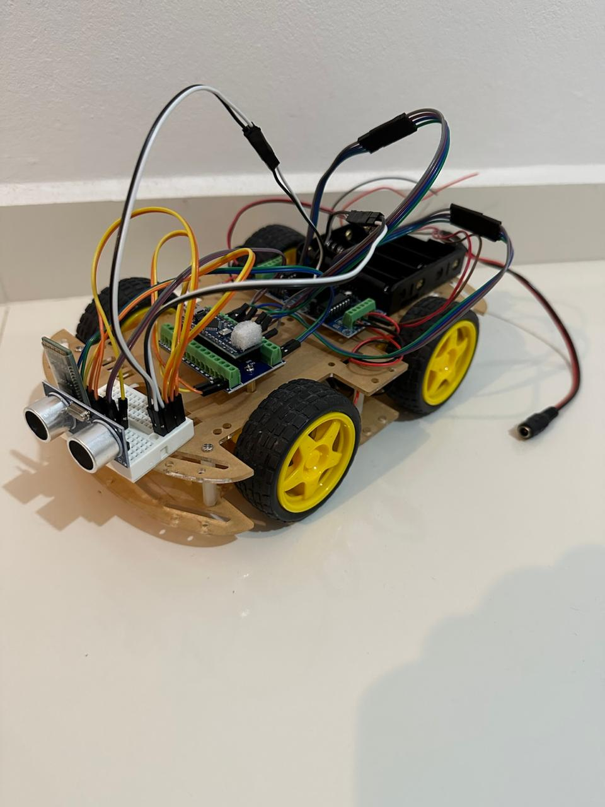
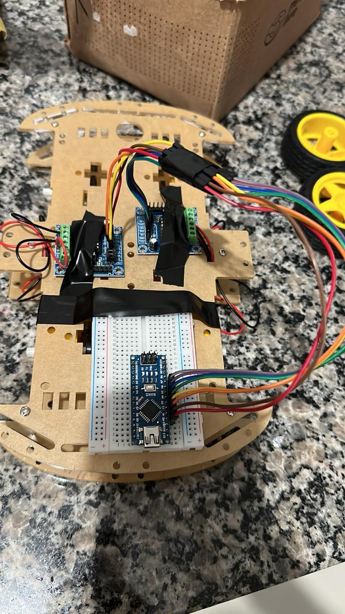

# ArduinoRCCar
<!-- PROJECT LOGO -->
 

  

A RC car using Arduino Nano and HC Bluetooth module connected to smartphone to control.

<!-- ABOUT THE PROJECT -->

## About The Project

    
    

    An Arduino-based remote-controlled (RC) car that combines electronics, coding, and robotics to create a fun and customizable vehicle. This project is perfect for hobbyists, students, and makers looking to explore wireless communication, motor control, and sensor integration.
    

## ✨ Features
- **Wireless Control** – Operated using the [Bluetooth RC Car](https://bluetooth-rc-controller.br.aptoide.com/app) app  
- **Motor Control** – Move forward, reverse, and turn using the L298N motor driver  
- **Simple & Expandable** – Easily add sensors like ultrasonic for obstacle detection  
- **Customizable** – Adjust speed, controls, and features  

## 🛠️ Components Used
- **Kit Chassis 4 Wheels 4WD**
- **Arduino Nano**  
- **2 Modules H Bridge L293d Motor Driver (one for each two wheels)**  
- **DC Motors with Wheels**  
- **Bluetooth Module (HC-05/HC-06)**  
- **Wire Jumpers Cables**
- **Power Supply (LiPo battery or battery pack, i used four 18650 batteries)**  
- *Optional:* Ultrasonic Sensor, LEDs, Buzzer  

## 📜 How It Works
The Arduino receives commands from the **Bluetooth RC Car** app via the HC-05/HC-06 module and translates them into motor movements for the L293d Motor Drivers. Additional sensors can be integrated for autonomous features.

📹 [Watch the demo video](images/video.mp4)

## 🚀 Getting Started
1. Assemble the Chassis with the DC Motors and Wheels.  
2. Assemble the Motos Drivers, Bluetooth Module, Arduino Nano and the Battery Pack to the chassis
2. Upload the Arduino code.  
3. Pair your phone with the Bluetooth module.  
4. Open the **Bluetooth RC Car** app and connect to the car.  
5. Start driving your RC car! 🚗💨  

    

---

📌 *Feel free to modify the project and add new features!*

<!-- ROADMAP -->
## Roadmap

✅ Bluetooth function
- [ ] Battery indicator
- [ ] Object impact avoidance

<!-- CONTACT -->
## Contact

Robson Vitor Rezini - rvrezini@gmail.com

Project Link: [https://github.com/rvrezini/ArduinoRCCar](https://github.com/rvrezini/ArduinoRCCar)

(<a href="#readme-top">back to top</a>)
 